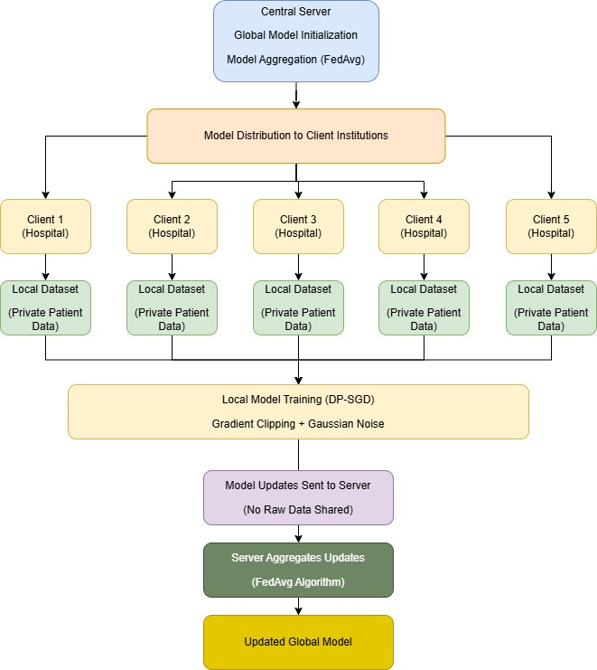
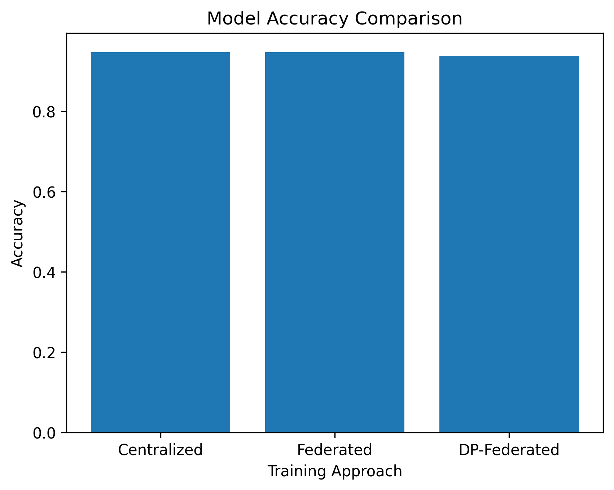
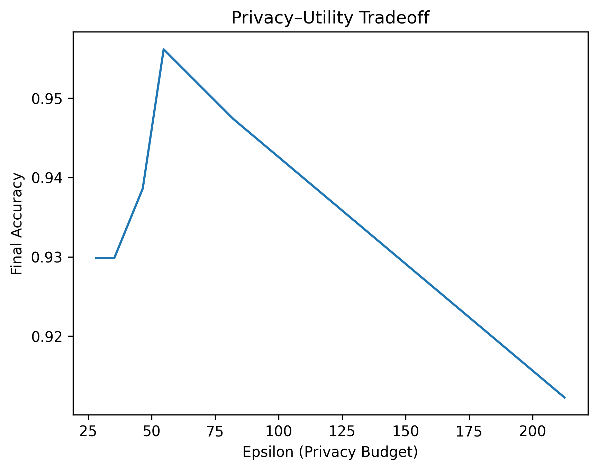

# 🏥 Privacy-Preserving Federated Learning for Disease Prediction

A Differential Privacy-based Federated Learning (DP-FL) framework for secure and collaborative disease prediction across multiple healthcare institutions.

---

## 🚀 Overview

Modern healthcare systems generate large volumes of sensitive patient data distributed across multiple institutions. Traditional centralized machine learning requires data sharing, which raises serious privacy and regulatory concerns.

This project proposes a **privacy-preserving federated learning framework** that enables multiple institutions to collaboratively train a model **without sharing raw data**, while ensuring **formal privacy guarantees using Differential Privacy (DP)**.

---

## 🧠 Key Features

- 🔗 Federated Learning (FL) for distributed model training  
- 🔐 Differential Privacy (DP) using DP-SGD  
- 🏥 Multi-institution simulation (cross-silo setting)  
- 📊 Privacy–utility trade-off analysis  
- ⚖️ Comparison with centralized learning  

---

## 🏗️ System Architecture



The system follows a **client-server federated learning setup**:

- A **central server** initializes and aggregates the global model  
- Multiple **clients (hospitals)** train locally on private datasets  
- Only **model updates are shared**, not raw data  
- Updates are aggregated using the **FedAvg algorithm**  

---

## ⚙️ Methodology

### 🔷 Training Paradigms

We evaluate three approaches:

- **Centralized Learning**  
- **Federated Learning (FL)**  
- **Differentially Private Federated Learning (DP-FL)**  

---

### 🏥 Data Simulation

- Dataset: **Breast Cancer Wisconsin Dataset**  
- Total Samples: 569  
- Features: 30 (continuous)  

Data is split into **5 independent clients**, each representing a hospital:
- No data sharing between clients  
- Independent local training  

---

### 🤖 Model Architecture

A **feedforward neural network** is used:

- Input Layer: 30 features  
- Hidden Layer 1: 64 neurons (ReLU)  
- Hidden Layer 2: 32 neurons (ReLU)  
- Output Layer: 1 neuron (binary classification)  

**Training Setup:**
- Loss: Binary Cross-Entropy with Logits  
- Optimizer: Stochastic Gradient Descent (SGD)  

---

### 🌐 Federated Learning Workflow

1. Server initializes global model  
2. Model is sent to all clients  
3. Clients train locally on private data  
4. Model updates are sent back to server  
5. Server aggregates updates using **FedAvg**  
6. Updated global model is redistributed  

---

### 🔐 Differential Privacy Integration

To prevent information leakage:

- **Gradient Clipping** → limits sensitivity  
- **Gaussian Noise Addition** → protects updates  

Implemented using:
- **DP-SGD (Opacus library)**  

Privacy tracking:
- **Rényi Differential Privacy (RDP)**  
- δ = 1e-5  

---

### ⚖️ Experimental Setup

- Noise Multiplier (σ): 0.5 → 1.5  
- Metrics:
  - Accuracy  
  - Training Loss  
  - Privacy Budget (ε)  

---

## 📊 Results & Discussion

### 🔷 Model Performance

| Approach | Accuracy | Training Loss |
|----------|---------|--------------|
| Centralized Learning | 94.74% | 0.152 |
| Federated Learning | 94.74% | 0.168 |
| DP-Federated Learning | 93.86% | 0.190 |

---

### 📈 Accuracy Comparison



### 🔍 Observations

- Federated Learning achieves **same performance as centralized learning**  
- DP-FL introduces **minor accuracy drop (~0.87%)**  
- Demonstrates feasibility of **privacy-preserving learning**  

---

## 🔐 Privacy–Utility Trade-off



### 📊 Key Insights

- Lower noise → higher accuracy, weaker privacy  
- Higher noise → stronger privacy, lower accuracy  

**Best balance at σ ≈ 1.0:**
- Accuracy: **95.61%**  
- Privacy Budget: **ε ≈ 54.75**

---

## ⚖️ Key Takeaways

- Federated Learning enables **secure collaboration without data sharing**  
- Differential Privacy provides **quantifiable privacy guarantees**  
- Accuracy loss is **minimal and manageable**  
- Suitable for **real-world healthcare deployment**  

---

## 🛠️ Tech Stack

- Python  
- PyTorch  
- Opacus (for Differential Privacy)  
- Scikit-learn  
- NumPy, Matplotlib  

---

## ▶️ How to Run

```bash
# Clone repository
git clone https://github.com/harshit-sharma14/final_major.git

# Navigate to project
cd final_major

# Install dependencies
pip install -r requirements.txt

# Run training
python train.py
